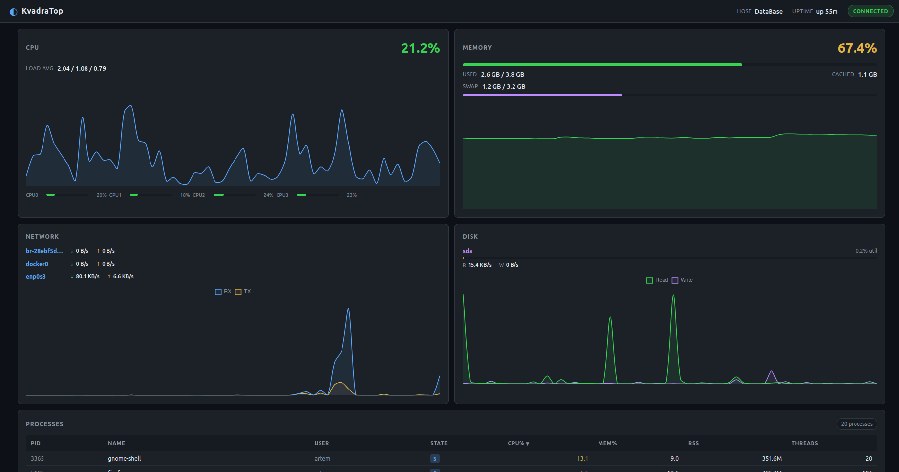
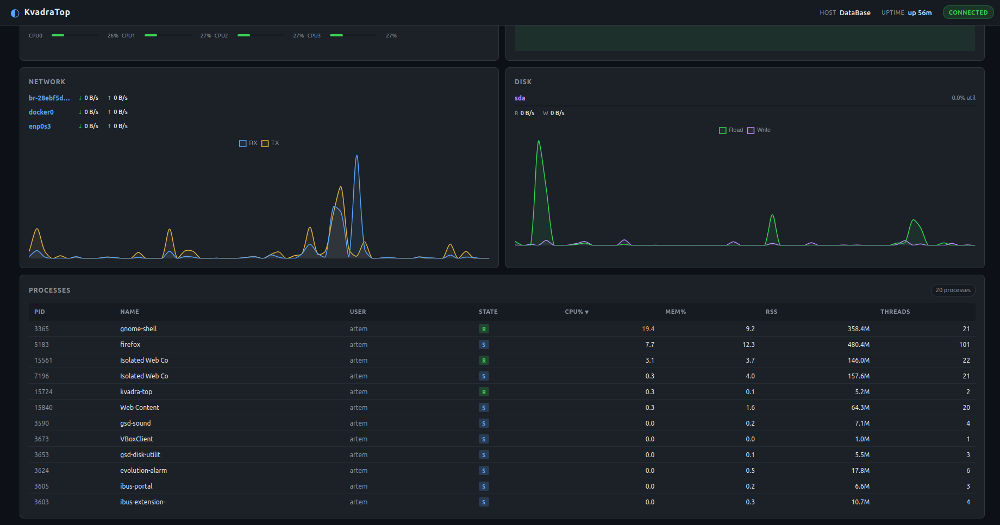

# KvadraTop

A real-time PC resource monitor with a dark-themed web dashboard.  
The C++ backend reads Linux `/proc` filesystem metrics every second and streams them via WebSocket to a TypeScript/Chart.js frontend.

---


## Architecture

```
  Browser (http://localhost:8080)
       |
       |  WebSocket (ws://host/ws)  — JSON every 1 s
       |  HTTP GET /                — serves index.html
       |  HTTP GET /assets/*        — serves JS/CSS
       v
  ┌──────────────────────────────────────────────────────┐
  │  kvadra-top  (C++ binary, Boost.Beast + Boost.Asio)  │
  │                                                      │
  │  main()                                              │
  │   └─ WebSocketServer (async, single io_context)      │
  │       ├─ WsSession  ── SessionRegistry (broadcast)   │
  │       └─ HTTP file handler (serves frontend/dist)    │
  │                                                      │
  │  MetricsCollector  (runs in main thread, 1 Hz)       │
  │   ├─ CpuMonitor     → /proc/stat, /proc/loadavg      │
  │   ├─ MemoryMonitor  → /proc/meminfo                  │
  │   ├─ NetworkMonitor → /proc/net/dev                  │
  │   ├─ DiskMonitor    → /proc/diskstats                │
  │   ├─ ProcessMonitor → /proc/<pid>/stat, /proc/uptime │
  │   └─ SystemInfo     → /proc/version, /etc/os-release │
  │                                                      │
  │  Serializer  → nlohmann/json → compact JSON string   │
  └──────────────────────────────────────────────────────┘

  frontend/src/
   ├─ main.ts              Entry point, wires everything together
   ├─ services/
   │   └─ MetricsService.ts   WebSocket client, auto-reconnect
   ├─ components/
   │   ├─ CpuPanel.ts         Total%, load avg, per-core bars, chart
   │   ├─ MemoryPanel.ts      RAM/swap bars, usage chart
   │   ├─ NetworkPanel.ts     Per-interface RX/TX rates, chart
   │   ├─ DiskPanel.ts        Per-device R/W rates, util bar, chart
   │   └─ ProcessTable.ts     Sortable top-20 process list
   └─ types/
       └─ metrics.ts          TypeScript types matching JSON schema
```

---

## JSON Snapshot Format

The backend broadcasts one JSON message per second to every connected client.

```json
{
  "timestamp_ms": 1746825600000,
  "cpu": {
    "total": 12.3,
    "load_avg": [0.45, 0.60, 0.72],
    "cores": [
      { "index": 0, "usage": 15.1 },
      { "index": 1, "usage":  9.8 }
    ]
  },
  "memory": {
    "total_kb":     16384000,
    "used_kb":       8192000,
    "free_kb":       1234000,
    "available_kb":  8000000,
    "buffers_kb":     512000,
    "cached_kb":     2048000,
    "swap_total_kb": 4096000,
    "swap_used_kb":   128000,
    "usage_percent":      50.0
  },
  "network": [
    {
      "name": "eth0",
      "rx_bytes": 123456789,
      "tx_bytes":  98765432,
      "rx_rate_bps": 125000.0,
      "tx_rate_bps":  15000.0
    }
  ],
  "disk": [
    {
      "name": "sda",
      "read_bytes":  10240000,
      "write_bytes":  5120000,
      "read_rate_bps":  2048000.0,
      "write_rate_bps":  512000.0,
      "util_percent":         3.5
    }
  ],
  "processes": [
    {
      "pid": 1234,
      "name": "my-app",
      "user": "alice",
      "state": "R",
      "cpu_percent": 24.5,
      "mem_percent":  1.2,
      "mem_rss_kb": 204800,
      "threads": 8,
      "uptime_s": 3600
    }
  ],
  "system": {
    "hostname": "my-machine",
    "kernel": "Linux version 6.8.0",
    "os": "Ubuntu 24.04 LTS",
    "uptime_seconds": 86400,
    "cpu_count": 8
  }
}
```

---

## Prerequisites

| Dependency | Minimum version | Notes |
|---|---|---|
| CMake | 3.20 | Build system for C++ backend |
| C++ compiler | GCC 11 / Clang 14 | Must support C++20 |
| Boost | 1.74 | `Boost::system` (Asio + Beast header-only) |
| OpenSSL | 1.1 / 3.x | Required by Boost.Beast |
| nlohmann/json | 3.11 | Fetched automatically if not found by CMake |
| Node.js | 18 | Frontend build toolchain |
| npm | 9 | Comes with Node.js |

### Ubuntu / Debian

```bash
sudo apt-get install build-essential cmake libboost-system-dev libssl-dev
# Node.js via NodeSource or nvm
curl -fsSL https://deb.nodesource.com/setup_20.x | sudo bash -
sudo apt-get install -y nodejs

# P.S. Here might be some problems with versions of packets but I'm pretty sure you can resolve them by yourself...
```

---

## Build

```bash
# Clone the repository
git clone https://github.com/resusfactor228/KvadraTop.git
cd KvadraTop

# One-shot build (frontend then backend)
./scripts/build.sh
```

The script runs:
1. `npm install && npm run build` in `frontend/`
2. `cmake .. && cmake --build .` in `backend/build/`

The resulting binary is at `backend/build/kvadra-top`.

### Manual build steps

```bash
# Frontend
cd frontend
npm install
npm run build       # output -> frontend/dist/

# Backend
cd ../backend
mkdir -p build && cd build
cmake .. -DCMAKE_BUILD_TYPE=Release
cmake --build . -j$(nproc)
```

---

## Running

```bash
# Use the convenience wrapper (default port 8080)
./scripts/run.sh

# Wrapper with custom port
./scripts/run.sh 9090

# Direct invocation
./backend/build/kvadra-top 8080 ./frontend/dist
```

Open **http://localhost:8080** in your browser.

---

## UI Features

| Panel | What it shows |
|---|---|
| **CPU** | Total usage %, per-core bars (green/orange/red), load averages (1/5/15 min), 60-second history chart |
| **Memory** | RAM usage %, used/total/cached, swap bar, 60-second history chart |
| **Network** | Per-interface RX/TX byte rates (auto-scaled to B/s, KB/s, MB/s), combined RX/TX history chart |
| **Disk** | Per-device read/write rates, utilisation bar (colour-coded), combined history chart |
| **Processes** | Top-20 processes by CPU; sortable by PID, Name, User, CPU%, MEM%, RSS, Threads; state badges (R/S/D/Z/T) |
| **Header** | Hostname, system uptime, live connection status badge (green/red) |

The dashboard auto-reconnects when the WebSocket connection drops (e.g. after restarting the backend).

---

## Screenshot




---

## Project Structure

```
KvadraTop/
+-- backend/
|   +-- CMakeLists.txt
|   +-- src/
|       +-- main.cpp
|       +-- MetricsCollector.{hpp,cpp}
|       +-- Serializer.{hpp,cpp}
|       +-- metrics/
|       |   +-- MetricsSnapshot.hpp
|       |   +-- CpuMonitor.{hpp,cpp}
|       |   +-- MemoryMonitor.{hpp,cpp}
|       |   +-- NetworkMonitor.{hpp,cpp}
|       |   +-- DiskMonitor.{hpp,cpp}
|       |   +-- ProcessMonitor.{hpp,cpp}
|       |   +-- SystemInfo.{hpp,cpp}
|       +-- server/
|           +-- WebSocketServer.{hpp,cpp}
|           +-- HttpFileHandler.{hpp,cpp}
+-- frontend/
|   +-- index.html
|   +-- package.json
|   +-- tsconfig.json
|   +-- src/
|       +-- main.ts
|       +-- styles/main.css
|       +-- types/metrics.ts
|       +-- services/MetricsService.ts
|       +-- components/
|           +-- CpuPanel.ts
|           +-- MemoryPanel.ts
|           +-- NetworkPanel.ts
|           +-- DiskPanel.ts
|           +-- ProcessTable.ts
+-- scripts/
|   +-- build.sh
|   +-- run.sh
+-- README.md
```
